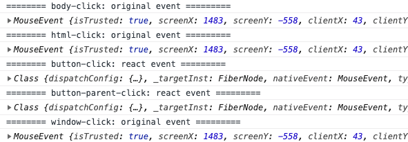

### DOM原生事件机制

DOM事件流（event  flow ）存在三个阶段：**事件捕获阶段、处于目标阶段、事件冒泡阶段。**

**事件捕获（event  capturing）：**通俗的理解就是，当鼠标点击或者触发dom事件时，浏览器会从根节点开始**由外到内**进行事件传播，即点击了子元素，如果父元素通过事件捕获方式注册了对应的事件的话，会先触发父元素绑定的事件。

**事件冒泡（dubbed  bubbling）：**与事件捕获恰恰相反，事件冒泡顺序是由内到外进行事件传播，直到根节点。

DOM标准事件流的触发的先后顺序为：**先捕获再冒泡**，即当触发dom事件时，会先进行事件捕获，捕获到事件源之后通过事件传播进行事件冒泡。不同的浏览器对此有着不同的实现，IE10及以下不支持捕获型事件，所以就少了一个事件捕获阶段，IE11、Chrome 、Firefox、Safari等浏览器则同时存在。

### React事件机制

`React`事件使用了事件委托的机制，一般事件委托的作用都是为了减少页面的注册事件数量，减少内存开销，优化浏览器性能，`React`这么做也是有这么一个目的，除此之外，也是为了能够更好的管理事件，实际上，`React`中所有的事件最后都是被委托到了 `document`这个顶级`DOM`上。

既然所有的事件都被委托到了 `document`上，那么肯定有一套管理机制，所有的事件都是以一种先进先出的队列方式进行触发与回调。


### 实例分析

```javascript
          window.onclick = function (e) {
                      console.log('======== window-click: original event =========')
                      console.log(e)
          }
          document.documentElement.onclick = function (e) {
                      console.log('======== html-click: original event =========')
                      console.log(e)
          }
          document.body.onclick = function (e) {
                      console.log('======== body-click: original event =========')
                      console.log(e)
          }
```

按照如上所说，DOM事件先捕获后冒泡，结果应如下：

window->html->body->html->window

但是实际结果是这样子的：


只执行了冒泡阶段，这是因为onclick只在冒泡阶段执行。

想要在捕获阶段执行，需改为这样：

```javascript
        window.addEventListener('click',function (e) {
            console.log('======== window-click: original event =========')
                console.log(e)
        },true)
        document.documentElement.addEventListener('click',function (e) {
            console.log('======== html-click: original event =========')
            console.log(e)
        },true)
        document.body.addEventListener('click',function (e) {
            console.log('======== body-click: original event =========')
            console.log(e)
        },true)
```

结果如下：


那react里的事件表现又是怎么样的呢？

如下代码：

```javascript
export default class Index extends React.Component {

    componentDidMount() {
        window.onclick = function (e) {
            console.log('======== window-click: original event =========')
            console.log(e)
        }
        document.documentElement.onclick = function (e) {
            console.log('======== html-click: original event =========')
            console.log(e)
        }
        document.body.onclick = function (e) {
            console.log('======== body-click: original event =========')
            console.log(e)
        }
    }

    parentClick=e=>{
        console.log('======== button-parent-click: react event =========')
        console.log(e)
    }

    onClick = (e) => {
        console.log('======== button-click: react event =========')
        console.log(e)
    }

    render() {
        return <div onClick={this.parentClick}>
            <button onClick={this.onClick}>click!</button>
        </div>
    }
}

```

结果如下：



如上所说，react的事件实际都注册在`document`上，而且绝大多数事件都注册在冒泡阶段，当事件冒泡到document时才会执行。

需要注意的时，react事件从目标元素向上，将父级绑定的相同事件push进执行队列，按先进先出触发。表现同冒泡一样。

我们从打印结果上可以看出，react的事件对象并不是原生事件对象。其实 react 对原生对象做了的内部处理，使得其上附加的描述属性完全符合 `W3C`的标准，因此在事件层面上具有跨浏览器兼容性，与原生的浏览器事件一样拥有同样的接口，也具备`stopPropagation()` 和 `preventDefault()`等方法。

但是问题来了，如果调用`stopPropagation()`的确会阻止事件冒泡，react的事件按理并不受影响。而实际上react让合成事件的表现达到了原生事件的效果，原因是react也对`stopPropagation()`这个方法做了处理：

```javascript
// packages/events/SyntheticEvent.js
stopPropagation: function() {
  const event = this.nativeEvent;
  if (!event) {
    return;
  }

  if (event.stopPropagation) {
    event.stopPropagation();
  } else if (typeof event.cancelBubble !== 'unknown') {
    // The ChangeEventPlugin registers a "propertychange" event for
    // IE. This event does not support bubbling or cancelling, and
    // any references to cancelBubble throw "Member not found".  A
    // typeof check of "unknown" circumvents this issue (and is also
    // IE specific).
    event.cancelBubble = true;
  }

  this.isPropagationStopped = functionThatReturnsTrue;
}
```

先执行原生的`stopPropagation`同时将`this.isPropagationStopped`设为`true`，这样就中断了遍历循环。


> 文章参考[React事件机制 - 源码概览（上）](https://juejin.im/post/5bd32493f265da0ae472cc8e)
