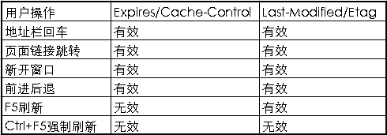
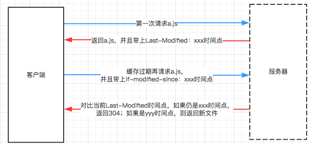

缓存问题呢是面试一个高频问题，网上文章也很多，但是当我面试别人的时候，发现很多人只知其一，如何处理好缓存问题很少有人答的好。

### 缓存类型

1. 强缓存：不会向服务器发送请求，直接从缓存中读取资源，在chrome控制台的network选项可以看到该请求返回的200状态码，并且size显示from disk cache或from memory cache；
2. 协商缓存：向服务器发送请求，服务器会根据这个请求的request header的一些参数来判断是否命中协商缓存，如果命中，则返回304状态码并带上新的response header通知浏览器从缓存中读取资源；
3. 两者的共同点，都是从客户端缓存中直接读取资源，**区别就是强缓存不会发请求（根据判断缓存是否超时来决定是否发送请求），协商缓存会发请求（根据服务器对资源文件的修改标识对比来判断是否要重新下载资源文件还是从直接浏览器缓存中读取）**；

其中强缓存受**Expires/Cache-Control**影响，协商缓存受**ETag/Last-Modified**影响。

### 如何判断缓存的过期以及文件的变动？

**判断缓存过期**

主要的方式有两种，这两种都是设定请求头中的某一个字段来实现的：1、Expires；2、Cache-Control。由于Cache-Control设置后优先级比前者高，这次作者就先说下通过Cache-Control来控制缓存。

**no-cache**

如果request headers中，Cache-Control为no-cache。表示不管服务端有没有设置Cache-Control，都必须从重新去获取请求。

**max-age=0**

max-age=0表示不管response怎么设置，在重新获取资源之前，先检验ETag/Last-Modified

不管是max-age=0还是no-cache，都会返回304（资源无修改的情况下），n**o-store才是真正的不进行缓存**。

**判断文件变动**

Last-Modified方式需要用到两个字段：Last-Modified & if-modified-since。先来看下这两个字段的形式：

Last-Modified : Fri , 12 May 2006 18:53:33 GMT

If-Modified-Since : Fri , 12 May 2006 18:53:33 GMT

可以看出其实形式是一样的，就是一个标准时间。那么怎么用呢？来看下图：

当第一次请求某一个文件的时候，就会传递回来一个Last-Modified 字段，其内容是这个文件的修改时间。当这个文件缓存过期，浏览器又向服务器请求这个文件的时候，会自动带一个请求头字段If-Modified-Since，其值是上一次传递过来的Last-Modified的值，拿这个值去和服务器中现在这个文件的最后修改时间做对比，如果相等，那么就不会重新拉取这个文件了，返回304让浏览器读过期缓存。如果不相等就重新拉取。

你可能会觉得使用Last-Modified已经足以让浏览器知道本地的缓存副本是否足够新，为什么还需要Etag（实体标识）呢？HTTP1.1中Etag的出现主要是为了解决几个Last-Modified比较难解决的问题：

1. Last-Modified标注的最后修改只能精确到秒级，如果某些文件在1秒钟以内，被修改多次的话，它将不能准确标注文件的新鲜度
2. 如果某些文件会被定期生成，当有时内容并没有任何变化，但Last-Modified却改变了，导致文件没法使用缓存。
3. 有可能存在服务器没有准确获取文件修改时间，或者与代理服务器时间不一致等情形。

Etag是服务器自动生成或者由开发者生成的对应资源在服务器端的唯一标识符，能够更加准确的控制缓存。Last-Modified与ETag是可以一起使用的，服务器会优先验证ETag，一致的情况下，才会继续比对Last-Modified，最后才决定是否返回304。

### 如何利用缓存

缓存能显而易见的提升网页加载速度，但是技能利用好缓存，又能保证资源实时更新呢。

1. 版本号管理：在资源路径上加上版本号。如果是和app混合开发，而且资源是html文件，需要额外的步骤

   1. 需要将版本号持久化
   2. 每一次更新资源，更新版本号。
   3. app每次打开会去请求后端接口，返回最新的版本号或地址。

   这种做法，方便版本回滚，只需要改变版本号就行了。同时对index.html也可以做缓存了。

2. 不对html文件做缓存。在静态资源服务那里配置，html文件的expires 为0天，或者cache-control为no-cache，这样html文件没有强缓存，每次会向服务器发请求，此时服务器会根据**ETag/Last-Modified**返回最新资源或者304。这种做法，资源的地址是固定的，相对简单，缺点是回滚不是很方便。

3. 针对js，css，图片等资源文件（非html）文件名加hash，与版本号一样，本质上资源路径变换，重新请求。

