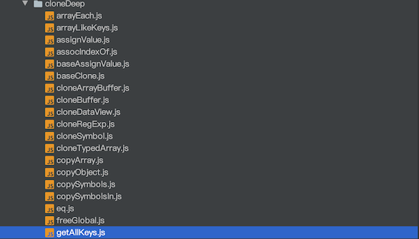
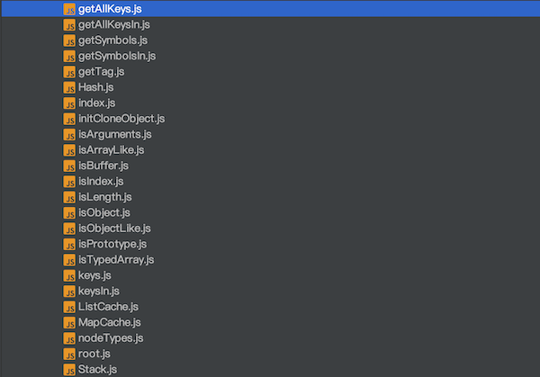

## 前言

精读系列，旨在分析一些高质量代码库，学习借鉴其中的思想，巩固js基础。

本文开始对lodash中的cloneDeep方法精读。

## 整理源码

首先把lodash中cloneDeep相关代码整理出来





42个文件，😭😭😭。

## 开始分析

首先看入口文件

```javascript
import baseClone from './baseClone.js'

/** Used to compose bitmasks for cloning. */
const CLONE_DEEP_FLAG = 1
const CLONE_SYMBOLS_FLAG = 4

/**
 * This method is like `clone` except that it recursively clones `value`.
 * Object inheritance is preserved.
 *
 * @since 1.0.0
 * @category Lang
 * @param {*} value The value to recursively clone.
 * @returns {*} Returns the deep cloned value.
 * @see clone
 * @example
 *
 * const objects = [{ 'a': 1 }, { 'b': 2 }]
 *
 * const deep = cloneDeep(objects)
 * console.log(deep[0] === objects[0])
 * // => false
 */
function cloneDeep(value) {
    return baseClone(value, CLONE_DEEP_FLAG | CLONE_SYMBOLS_FLAG)
}

export default cloneDeep
```

baseClone方法第二个参数`CLONE_DEEP_FLAG | CLONE_SYMBOLS_FLAG`，这个参数显然是控制baseClone采用哪种克隆方式的，但是为啥会用位运算呢，有点懵逼。

一番百度之后，弄明白了。

结合baseClone分析。

```javascript
/** Used to compose bitmasks for cloning. */
const CLONE_DEEP_FLAG = 1
const CLONE_FLAT_FLAG = 2
const CLONE_SYMBOLS_FLAG = 4

function baseClone(value, bitmask, customizer, key, object, stack) {
    let result
    const isDeep = bitmask & CLONE_DEEP_FLAG
    const isFlat = bitmask & CLONE_FLAT_FLAG
    const isFull = bitmask & CLONE_SYMBOLS_FLAG

    if (customizer) {
        result = object ? customizer(value, key, object, stack) : customizer(value)
    }
    if (result !== undefined) {
        return result
    }
    if (!isObject(value)) {
        return value
    }
    const isArr = Array.isArray(value)
    const tag = getTag(value)
    if (isArr) {
        result = initCloneArray(value)
        if (!isDeep) {
            return copyArray(value, result)
        }
    } else {
        const isFunc = typeof value == 'function'

        if (isBuffer(value)) {
            return cloneBuffer(value, isDeep)
        }
        if (tag == objectTag || tag == argsTag || (isFunc && !object)) {
            result = (isFlat || isFunc) ? {} : initCloneObject(value)
            if (!isDeep) {
                return isFlat
                    ? copySymbolsIn(value, copyObject(value, keysIn(value), result))
                    : copySymbols(value, Object.assign(result, value))
            }
        } else {
            if (isFunc || !cloneableTags[tag]) {
                return object ? value : {}
            }
            result = initCloneByTag(value, tag, isDeep)
        }
    }
    // Check for circular references and return its corresponding clone.
    stack || (stack = new Stack)
    const stacked = stack.get(value)
    if (stacked) {
        return stacked
    }
    stack.set(value, result)

    if (tag == mapTag) {
        value.forEach((subValue, key) => {
            result.set(key, baseClone(subValue, bitmask, customizer, key, value, stack))
        })
        return result
    }

    if (tag == setTag) {
        value.forEach((subValue) => {
            result.add(baseClone(subValue, bitmask, customizer, subValue, value, stack))
        })
        return result
    }

    if (isTypedArray(value)) {
        return result
    }

    const keysFunc = isFull
        ? (isFlat ? getAllKeysIn : getAllKeys)
        : (isFlat ? keysIn : keys)

    const props = isArr ? undefined : keysFunc(value)
    arrayEach(props || value, (subValue, key) => {
        if (props) {
            key = subValue
            subValue = value[key]
        }
        // Recursively populate clone (susceptible to call stack limits).
        assignValue(result, key, baseClone(subValue, bitmask, customizer, key, value, stack))
    })
    return result
}
```

`bitmask & CLONE_DEEP_FLAG`表示位掩码参数是否拥有`CLONE_DEEP_FLAG`，而`CLONE_DEEP_FLAG | CLONE_SYMBOLS_FLAG`表示两个flag都拥有。本质上是下面这样的过程

```javascript
const bitmask=1|4 
// 1.转化为二进制：001|100->101
// 2.转化为十进制：101->5
bitmask & 1 //-> 5&1
// 1.转化为二进制：101&001->001
// 2.转化为布尔值：001->1-> true
bitmask & 2 //-> 5&2 ->0-> false
bitmask & 4 //-> 5&4 ->4-> true
```

至于为什么要采取位运算，因为快。对于这样的基础库，作者用牺牲语义明确换取性能是很明智的选择。

接着往下分析

#### 判断是否为对象

```javascript
if (!isObject(value)) {
    return value
}

function isObject(value) {
  const type = typeof value
  return value != null && (type == 'object' || type == 'function')
}
```

`value!=null`排除了null与undefined，那么不是object与function的就可以认为是基本数据类型。

#### 对值进行toString

```javascript
function getTag(value) {
  if (value == null) {
    return value === undefined ? '[object Undefined]' : '[object Null]'
  }
  return toString.call(value)
}
```

null与undefined是没有toString方法的，所以做了范式处理。

#### clone数组

```javascript
/**
 * Initializes an array clone.
 *
 * @private
 * @param {Array} array The array to clone.
 * @returns {Array} Returns the initialized clone.
 */
function initCloneArray(array) {
    const { length } = array
    const result = new array.constructor(length)

    // Add properties assigned by `RegExp#exec`.
    if (length && typeof array[0] == 'string' && hasOwnProperty.call(array, 'index')) {
        result.index = array.index
        result.input = array.input
    }
    return result
}
```

这个方法是返回一个和给定数组长度相同的稀松数组，`length && typeof array[0] == 'string' && hasOwnProperty.call(array, 'index')`这个判断其实是针对的是exec方法返回的特定数组，mdn上有这样一个例子

```js
var re = /quick\s(brown).+?(jumps)/ig;
var result = re.exec('The Quick Brown Fox Jumps Over The Lazy Dog');

// result
// ["Quick Brown Fox Jumps", "Brown", "Jumps", index: 4, input: "The Quick Brown Fox Jumps Over The Lazy Dog", groups: undefined]
```

## 总结

本篇做了关于cloneDeep的精读开篇，接下来将深入了解其对复杂数据类型的判断与clone处理。